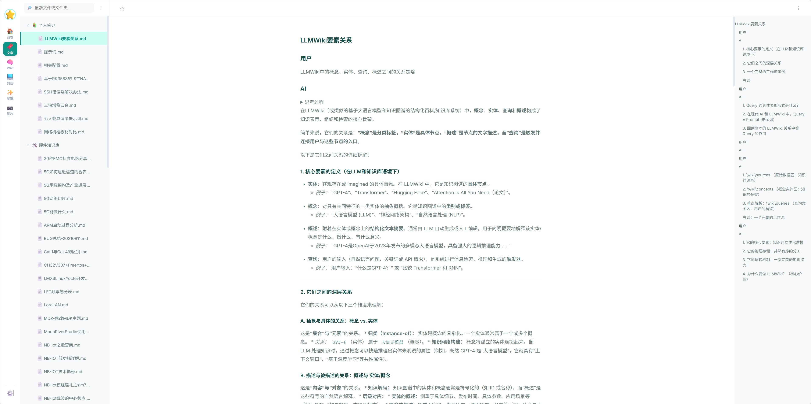
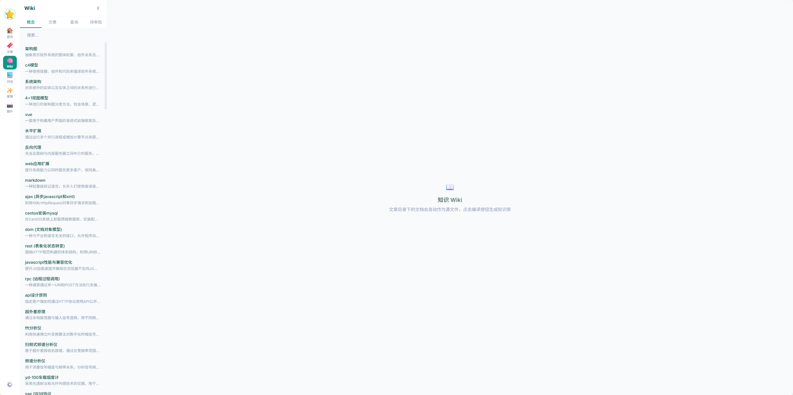
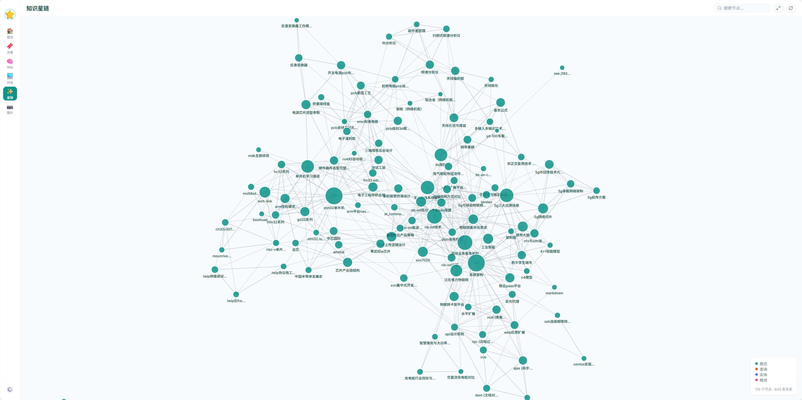
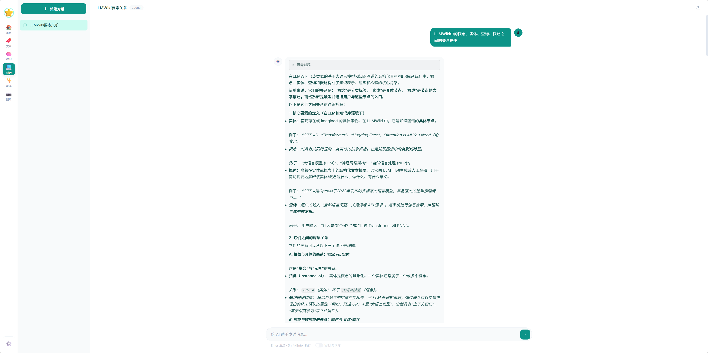
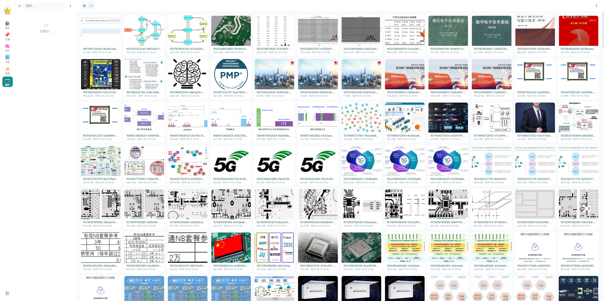

# 📝 LLMWikiPersonalNote

**AI-Powered Personal Knowledge Management System**

[](https://www.python.org/)
[](https://flask.palletsprojects.com/)
[](LICENSE)

一个基于 Flask 的全栈个人知识管理系统。将散落的笔记、文章、图片统一管理，通过 LLM 自动编译为互链 Wiki 知识库，并以力导向图谱可视化概念关联。

[English](#) · [快速开始](#-快速开始) · [功能展示](#-功能展示) · [技术架构](#-技术架构)

---
## ToDo

- [ ] 首页优化
- [ ] Todo 功能

## 感谢

- [Flask](https://github.com/pallets/flask)
- [Blossom](https://github.com/blossom-editor/blossom)
- [llm-wiki-compiler](https://github.com/atomicstrata/llm-wiki-compiler)
- [Fluent Emoji](https://github.com/microsoft/fluentui-emoji)

## ✨ 亮点

- 🧠 **LLM 知识编译** — 文章自动提取概念，生成互链 Wiki 页面，支持增量编译
- 🔍 **向量语义检索** — OpenAI Embedding + BM25 混合查询，精准命中知识库内容
- 🕸️ **知识星链** — D3.js 力导向图可视化概念关联，拖拽/缩放/搜索
- ✅ **审批流** — 编译产出先进入待审批状态，逐个审核后才正式入库
- 🔗 **来源溯源** — 每段内容标注 `^[来源文件]`，可追溯 LLM 生成内容的依据
- 💬 **多模型 AI 对话** — 支持 OpenAI / Claude / Gemini / Ollama，流式输出思考链
- 📄 **Markdown 原生** — 文章以 `.md` 文件存储，零锁定，随时可迁移
- 🎨 **主题切换** — 青绿/粉色双主题，Fluent Emoji 3D 图标系统

## 📸 功能展示

### 📚 文章管理

Markdown 阅读与编辑双模式，知识库文件夹管理，自定义 Fluent Emoji 图标，文档收藏与拖拽排序，附件上传与管理。

### 🧠 Wiki 知识库

从文章目录自动提取核心概念，通过两阶段编译管道（概念提取 → 页面生成）生成互链 Wiki 页面。支持增量编译（SHA-256 哈希检测变更）和全量编译。

```
resource/article/*.md → LLM 概念提取 → 概念合并 → 页面生成 → resource/wiki/concepts/*.md
                                                              → resource/wiki/index.md
                                                              → 向量索引 (Embedding)
```

**编译特性**：
- 动态批量提取（3-10 篇/批），自动调整批次大小
- 5 线程并发生成概念页面
- `[[概念名]]` 双向链接，自动解析
- 来源溯源 `^[filename.md:42-58]` 行级引用
- 编译产出默认进入待审批状态，通过后才入索引和图谱
- 实时编译进度追踪，错误分级处理

### 🔍 智能查询
基于 OpenAI Embedding 向量检索 + BM25 关键词匹配的混合搜索：

```
用户问题 → Embedding 向量化 → 余弦相似度检索 (0.7 权重)
                              → BM25 关键词匹配  (0.3 权重)
                              → 加权融合取 Top 5
         → 加载精选页面全文 → LLM 基于上下文回答 → 标注参考来源
```

### 🕸️ 知识星链

D3.js v7 力导向图，节点大小反映关联数量，模糊匹配算法（精确匹配 → 标题包含 → slug 包含）最大化连线展示。支持搜索过滤、拖拽、缩放、悬停高亮。

### 💬 AI 聊天

多模型对话，支持流式思考链输出，可开启 Wiki 知识库上下文注入，聊天记录可一键转存为文章或 Wiki 页面。

### 🖼️ 图片管理

一级文件夹目录树，自定义图标，上传/批量删除/搜索/预览，网格/列表双视图。

### 📋 更多模块
| 模块 | 功能 |
|------|------|
| 首页 | 天气时钟、收藏卡片、数据统计、可拖拽布局 |
| 笔记 | 快速笔记，随时记录灵感 |
| 计划 | 计划管理，跟踪目标进度 |
| 待办 | 待办事项，完成打勾 |
| 设置 | 主题切换、LLM 配置、资源路径配置 |

## 🏗️ 技术架构

```
src/
├── app.py                         # Flask 应用入口 + SQLite 自动迁移
├── config.py                      # 配置管理
├── extensions.py                  # 共享扩展（SQLAlchemy db）
├── common/
│   ├── llm.py                     # LLM 适配器（OpenAI/Claude/Gemini/Ollama）
│   ├── llm_config.py              # LLM 配置 CRUD（数据库持久化）
│   └── response.py                # 统一 JSON 响应格式
├── modules/
│   ├── article/                   # 文章模块（Markdown 渲染、文件夹管理、附件）
│   ├── wiki/
│   │   ├── compiler/              # 编译引擎（模块化）
│   │   │   ├── pipeline.py        # 编译 + 查询编排
│   │   │   ├── extractor.py       # 概念提取（单篇/批量）
│   │   │   ├── generator.py       # 页面生成 + 候选页面
│   │   │   ├── retrieval.py       # 向量检索 + BM25 混合搜索
│   │   │   ├── prompts.py         # Prompt 模板
│   │   │   ├── hasher.py          # SHA-256 变更检测
│   │   │   └── status.py          # 编译状态管理（线程安全）
│   │   ├── wiki_service.py        # 文件系统操作
│   │   ├── models.py              # WikiPage 模型（含溯源、审批字段）
│   │   ├── routes.py              # API 路由 + 审批接口
│   │   └── templates/
│   │       ├── wiki.html          # Wiki 浏览 + 审批 UI
│   │       └── graph.html         # 知识星链图谱
│   ├── chat/                      # AI 聊天（流式输出、Wiki 上下文注入）
│   ├── picture/                   # 图片管理
│   ├── home/                      # 首页仪表盘
│   ├── note/                      # 快速笔记
│   ├── plan/                      # 计划管理
│   ├── todo/                      # 待办事项
│   ├── settings/                  # 系统设置
│   └── weather/                   # 天气模块
├── static/
│   ├── css/                       # 样式（组件化：article/chat/graph/wiki/...）
│   ├── emoji/                     # Fluent Emoji 3D 图标（200+）
│   └── lib/                       # 本地第三方库（Font Awesome、Chart.js）
└── templates/                     # Jinja2 模板（SPA 式单页架构）
```

## 🚀 快速开始

### 环境要求

| 依赖 | 版本 |
|------|------|
| Python | >= 3.8 |
| pip | latest |

### 1. 克隆项目

```bash
git clone https://github.com/zsafly-star/LLMWikiPersonalNote.git
cd LLMWikiPersonalNote/src
```

### 2. 安装依赖

```bash
# 推荐：使用 conda
conda create -n flask python=3.10
conda activate flask
pip install -r requirements.txt

# 或使用 venv
python -m venv venv
source venv/bin/activate  # Linux/macOS
.\venv\Scripts\activate   # Windows
pip install -r requirements.txt
```


### 3. 启动

```bash
python app.py
```

访问 **http://localhost:5000** 即可使用。

Windows 用户可使用开发脚本：

```powershell
.\dev.ps1 start    # 启动
.\dev.ps1 stop     # 停止
.\dev.ps1 restart  # 重启
.\dev.ps1 status   # 查看状态
```

## 📡 API 概览

### Wiki 知识库

| 接口 | 方法 | 说明 |
|------|------|------|
| `/api/wiki/compile` | POST | 启动编译（支持增量/全量） |
| `/api/wiki/status` | GET | 实时编译进度 |
| `/api/wiki/pages` | GET | 概念页面列表（已审批） |
| `/api/wiki/pages/<slug>` | GET/DELETE | 页面详情 / 删除 |
| `/api/wiki/sources` | GET | 源文章列表（含编译状态） |
| `/api/wiki/graph` | GET | 知识图谱数据（节点+边） |
| `/api/wiki/query` | POST | 智能查询（向量+BM25混合） |
| `/api/wiki/candidates` | GET | 待审批页面列表 |
| `/api/wiki/candidates/<id>/approve` | POST | 通过审批 |
| `/api/wiki/candidates/<id>/reject` | DELETE | 拒绝并删除 |

### 文章 / 图片 / 聊天

<details>
<summary>展开查看完整 API 列表</summary>

**文章模块**

| 接口 | 方法 | 说明 |
|------|------|------|
| `/api/article/tree` | GET | 知识库目录树 |
| `/api/article/content` | GET | 获取文章（Markdown 渲染） |
| `/api/article/content` | POST | 保存文章 |
| `/api/article/folder` | POST | 创建文件夹 |
| `/api/article/folder-meta` | GET/POST | 文件夹元信息（图标等） |
| `/api/article/upload-attachment` | POST | 上传附件 |
| `/api/article/attachments` | GET | 附件列表（分页） |

**图片模块**

| 接口 | 方法 | 说明 |
|------|------|------|
| `/api/picture/tree` | GET | 图片目录树 |
| `/api/picture/images` | GET | 图片列表 |
| `/api/picture/upload` | POST | 上传图片 |
| `/api/picture/delete-images` | POST | 批量删除 |

**聊天模块**

| 接口 | 方法 | 说明 |
|------|------|------|
| `/api/chat/sessions` | GET/POST | 会话列表 / 创建 |
| `/api/chat/sessions/<id>/stream` | POST | 流式对话 |
| `/api/chat/sessions/<id>/to-article` | POST | 聊天转笔记 |

</details>

## 💾 数据存储

所有用户数据以文件系统为主，SQLite 为辅，**零云依赖**：

| 数据 | 存储方式 | 位置 |
|------|---------|------|
| 知识库文章 | Markdown 文件 | `resource/article/` |
| Wiki 概念页面 | Markdown + JSON Frontmatter | `resource/wiki/concepts/` |
| 向量索引 | JSON | `resource/wiki/embeddings.json` |
| 图片 / 附件 | 文件系统 | `resource/img/` / `resource/attachments/` |
| 聊天记录 / Wiki 元数据 | SQLite | `resource/instance/sseditor.db` |

## 🛠️ 技术栈

| 类别 | 技术 |
|------|------|
| **后端** | Flask, SQLAlchemy, SQLite |
| **前端** | 原生 JavaScript, Jinja2 模板 |
| **AI** | OpenAI API, Anthropic API, Gemini API, Ollama |
| **向量检索** | OpenAI Embedding (`text-embedding-3-small`) |
| **可视化** | D3.js v7 (力导向图), Chart.js |
| **Markdown** | Python-Markdown |
| **图标** | Fluent Emoji 3D (200+), Font Awesome 6.4 |
| **样式** | CSS 自定义属性, 组件化 CSS 模块 |

## 🤝 贡献

欢迎提交 Issue 和 Pull Request！

1. Fork 本仓库
2. 创建功能分支 (`git checkout -b feature/amazing-feature`)
3. 提交变更 (`git commit -m 'Add amazing feature'`)
4. 推送到分支 (`git push origin feature/amazing-feature`)
5. 创建 Pull Request

## 📄 许可证

本项目基于 [MIT License](LICENSE) 开源。

---

<div align="center">

**如果这个项目对你有帮助，请给个 ⭐ Star！**

</div>
